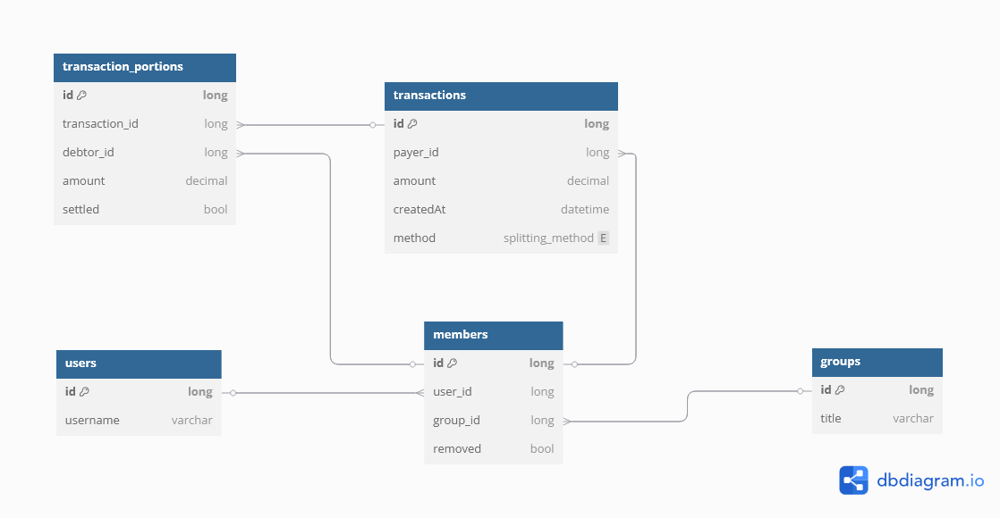
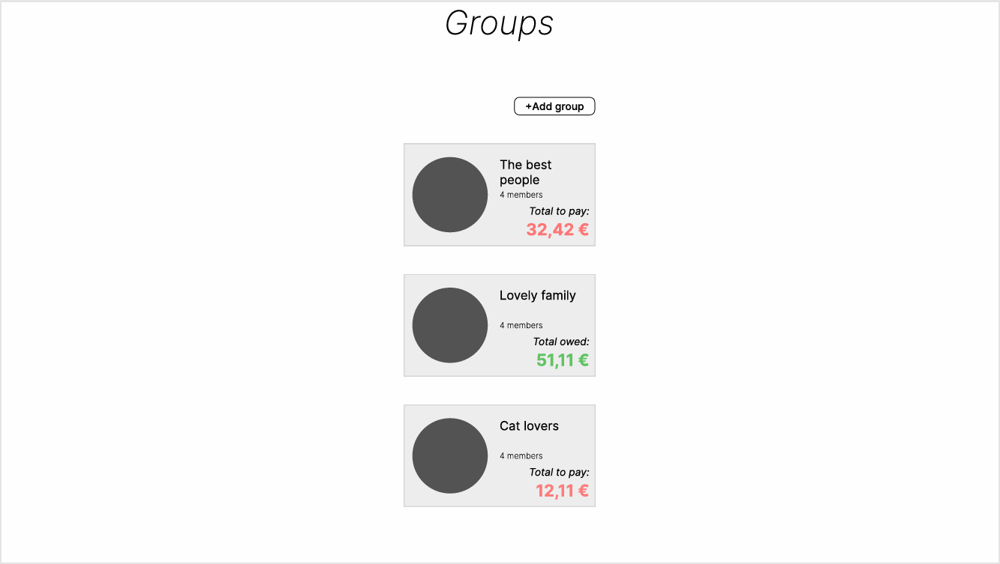

# PC-internship-group-transactions

## About

A simple web app for splitting bills with friends and alike.

## Highlights

### Tech stack

- React TypeScript
- ASP.NET Core
- Entity Framework Core (In-memory)
- FluentValidation
- AutoMapper
- MediatR
- Vite
- Axios
- TanStack Query and Router
- Tailwind
- ShadCN

### Architecture and design patterns

#### Backend

- Clean architecture (Domain, Application, Infrastructure, Server/API)
- Minimal CQRS
- REPR (request-endpoint-response)
- Unit of work

#### Frontend

- Container/Presentational
- API layer

## Screenshots

### Entity-relationships diagram


### Figma prototype




### Web app


## Setup instructions

#### Visual Studio 2022

1. Open solution file
2. Start project
3. Web app should launch in browser

#### VS Code (Frontend project only)

1. Go to 'pc.quiz.client' in terminal
2. Run command:

```
npm run dev
```

## Shortcomings

### Missing features

- Settling amount with members
- Removing members from a group
- Creating a new transaction

### Needed improvements

- Global state management (instead of .env file)
- API route definition collection file
- Query key collection file
